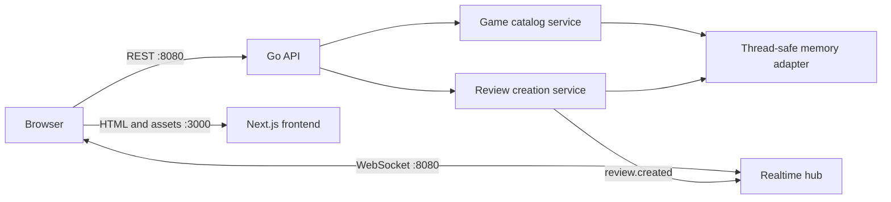
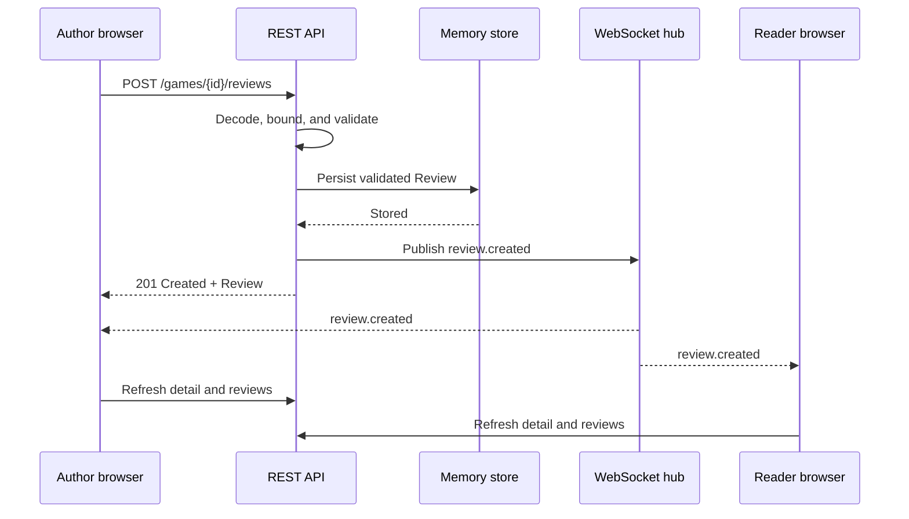

# Viger Architecture

## Context

Viger serves visitors who browse games, read reviews, and publish a review without an account. The exercise requires separate frontend and backend components communicating through REST, simple non-external storage, Docker builds, and one-command startup. Viger additionally sends live review notifications to other open browsers.

## Runtime components



Docker Compose builds and runs `frontend` and `backend` as separate hardened containers. Both ports bind only to the local loopback interface. There is intentionally no reverse proxy because it is not required by the exercise.

## Backend dependency direction

```text
cmd/server
    └── platform wiring
        ├── inbound HTTP adapter
        ├── realtime WebSocket adapter
        └── outbound memory adapter
                 ↓ implements
core/game and core/review
    ├── domain models and invariants
    ├── ports
    └── application services
```

The core does not import HTTP, WebSocket, JSON, or the memory adapter. HTTP handlers translate transport input and output. Services coordinate use cases and domain construction. The memory adapter implements repository ports and owns synchronization.

“Separate services” means separate application responsibilities and dependency boundaries, not separate deployable processes. Catalog reads, including reading a game's reviews, live in `core/game/services/service.go`. Review creation lives in `core/review/services/service.go`. Game and Review also have separate domain models and repository ports. The single in-memory store implements both repository ports in one adapter because all data shares the same process lifetime and synchronization boundary.

The service interfaces are deliberately small. `Clock` and `IDGenerator` ports exist because time and random IDs otherwise make review use-case tests nondeterministic. No generic repository or dependency-injection framework is used.

## Read flow

1. The frontend derives search, filter, sort, and page state from URL parameters.
2. TanStack Query calls the typed API client.
3. The HTTP handler parses bounded query values and invokes the game service.
4. The service reads games and review statistics through ports, applies filtering and sorting, and returns a page.
5. The HTTP adapter emits the documented JSON contract.
6. Zod validates the response before React renders it.

## Review creation and realtime flow



REST remains authoritative. The event includes the created review for low-latency user feedback, but clients invalidate and refresh their REST cache. Review IDs prevent the same logical review from being confused with another event. A reconnect does not replay events; normal REST refresh restores current state.

## Validation and security boundaries

- Backend domain constructors enforce model invariants.
- HTTP accepts only JSON for review writes, rejects unknown fields and multiple JSON values, and limits request bodies to 16 KiB.
- Pagination, sort values, search length, ratings, names, text, control characters, headers, server timeouts, write rate, WebSocket message size, and connection count are bounded.
- CORS and WebSocket upgrades use an explicit origin allowlist.
- React renders reviews as text and escapes user-controlled content.
- Logs include request metadata and IDs but exclude review content.
- API failures return stable error codes without stack traces.
- Runtime containers are non-root, read-only, capability-free, and restricted to local published ports.

No cookie or bearer authentication exists, so CSRF and authorization are outside the current threat model. Adding accounts would require both.

## Reliability and observability

- The memory store uses a read/write mutex and is exercised under Go's race detector.
- The HTTP server has read-header, read, write, idle, header-size, and graceful-shutdown controls.
- Liveness and readiness endpoints support container orchestration.
- Structured JSON logs include request ID, method, path, status, and duration.
- `/metrics` exposes request, review, active WebSocket, and broadcast measurements.
- Frontend REST use continues if WebSocket is temporarily offline; the client reports and retries the connection.

## Scaling path

The exercise runs one backend process. A production evolution would replace the memory adapter with durable storage and connect review creation to a transactional event/outbox path. A shared pub/sub system would distribute events across replicas. Those changes fit behind existing repository and event publisher ports; they are intentionally not implemented here.
